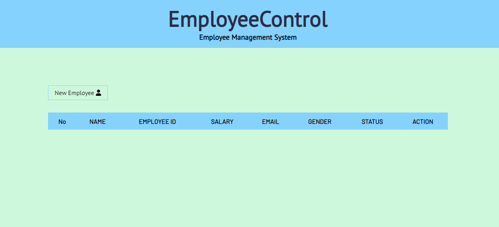
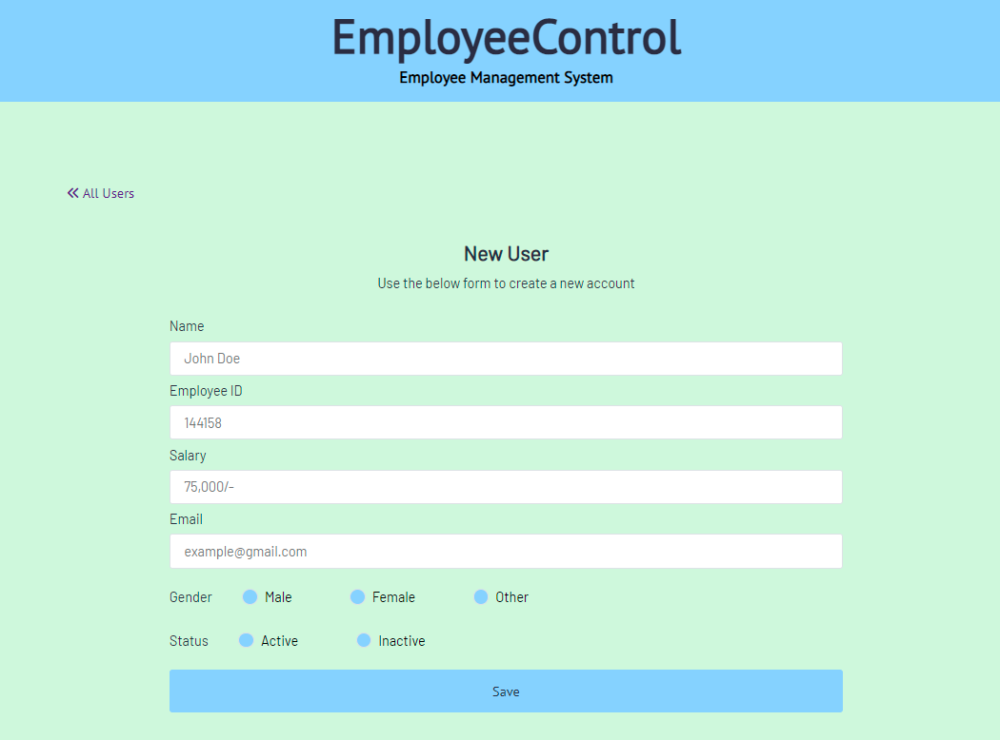
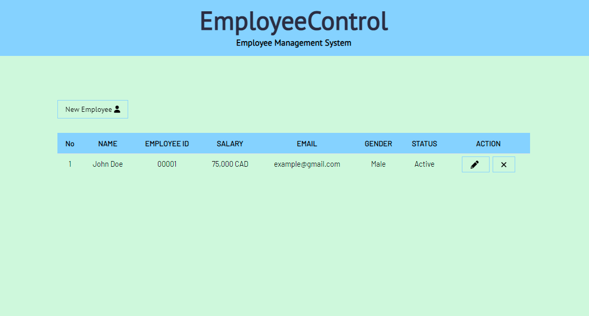
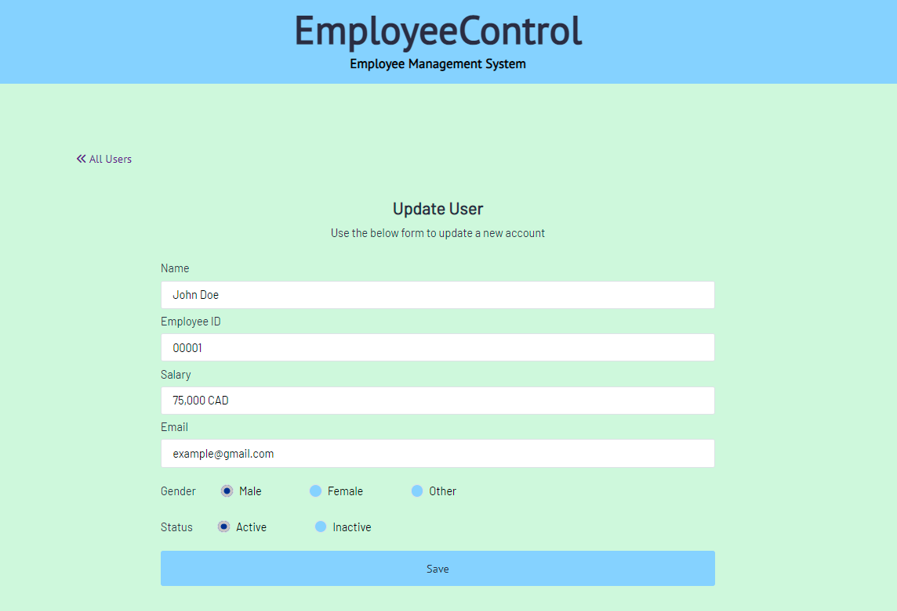

# EmployeeConnect

EmployeeConnect is an Management System application that assists organizations in overseeing it's employees. It is an administration tool that uses various web technologies to process data efficiently.

### Link: 
______________________________________________________________

Please click the following link to visit the website: [Employee Connect](https://fast-sea-48182.herokuapp.com/).

### Technology
______________________________________________________________
List of the technologies used: 

     1. Javascript
     2. CSS 
     3. Node
     4. Express
     5. MongoDB

### Functionality:
______________________________________________________________
The data that is presented is:

     1. Name
     2. Employee ID
     3. Salary
     4. Email
     5. Gender
     6. Status

The user may also edit or delete the relevent data.

### Screenshots:
______________________________________________________________

## Future Steps:
______________________________________________________________
     1. Create User/ Login in functionality.
     2. Search tool.
     3. Sort Tool

